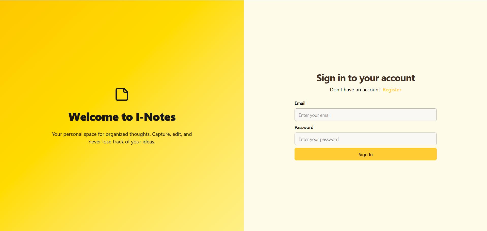

<h1 align="center"># 📝 Inotes – Full-Stack Notes App</h1>

Inotes is a full-stack cloud-based note-taking platform that allows users to create, update, and delete notes with secure authentication. It includes a Spring Boot backend and a Vite-powered React frontend.

---

## 📚 Table of Contents

- [✨ Introduction](#-introduction)
- [🚀 Get Started](#-get-started)
  - [📦 Backend Setup (Spring Boot)](#-backend-setup-spring-boot)
  - [🛍️ Frontend Setup (React - Vite)](#-frontend-setup-react)
- [📂 Project Structure](#-project-structure)
- [🛠️ Technologies Used](#️-technologies-used)
---

## ✨ Introduction

Inotes is a modern note-taking platform that enables users to:

- Register and authenticate
- Create new notes
- Update existing notes
- Delete notes securely


It is composed of:
- A **Spring Boot** backend for handling authentication and CRUD operations
- A **React (Vite)** frontend for a smooth user experience

---

## 🚀 Get Started

### 📦 Backend Setup (Spring Boot)

1. Clone the repo:
   ```bash
   git clone https://github.com/quantambites/ecommerce.git
   cd ecommerce/server
   ```

2. Install dependencies and run:
   - Using Maven:
     ```bash
     ./mvnw clean install
     ./mvnw spring-boot:run
     ```

   - Or via your IDE (IntelliJ/VSCode): Run `EcommerceServerApplication.java`

---

### 📱 Frontend Setup (React - Vite)

1. Navigate to frontend directory:
   ```bash
   cd ecommerce/client
   ```

2. Install dependencies:
   ```bash
   npm install
   ```

3. Set up your environment variables (see below) , remove the firebase hosting files

4. Start the app:
   ```bash
   npm run dev
   ```

---

## 📂 Project Structure

```
Notes_app/
│
├── notes_server/              # Spring Boot backend
│   └── src/main/java/   # Controllers, Services, Models, Repositories, Config
│
├── notes_client/              # React frontend (Firebase ready)
│   └── src/             # Components, Pages, Redux slices, Utils
│
├── .gitignore
└── README.md
```

---

## 🛠️ Technologies Used

- **Frontend:** React + Vite + Redux Toolkit + Axios
- **Backend:** Spring Boot + MongoDB 
- **Auth:** Cookie-based JWT Auth
- **Database:** MongoDB Atlas

---


<p align="center">
  
</p>

<p align="center">
  
</p>
